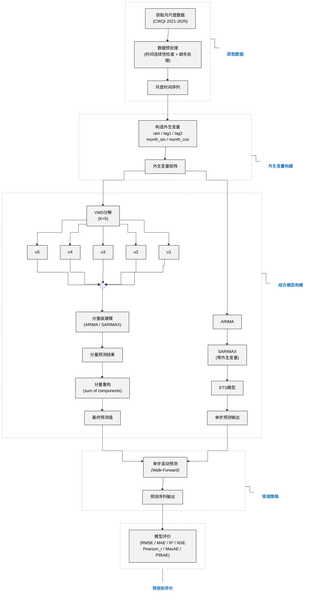

```mermaid
%%{init: {"flowchart": {"curve": "step"}} }%%
flowchart TB

classDef box fill:#f2f2f2,stroke:#000,stroke-width:1px,color:#000;
classDef stageNote fill:#ffffff,stroke:#ffffff,color:#1f77b4,font-weight:bold;

%% =========================
%% 第一层：数据获取（虚线阶段框）
%% =========================
subgraph S1[" "]
direction TB
  n1["获取月尺度数据<br/>(CWQI 2021-2025)"]:::box
  n2["数据预处理<br/>(时间连续性检查 + 缺失处理)"]:::box
  n3["月度时间序列"]:::box
  n1 --> n2 --> n3
end
style S1 fill:#ffffff,stroke:#9a9a9a,stroke-width:1px,stroke-dasharray:5 5

s1note["获取数据"]:::stageNote
S1 --- s1note

%% =========================
%% 第二层：外生变量构造（虚线阶段框）
%% =========================
subgraph S2[" "]
direction TB
  n4["构造外生变量<br/>rain / lag1 / lag2<br/>month_sin / month_cos"]:::box
  n5["外生变量矩阵"]:::box
  n4 --> n5
end
style S2 fill:#ffffff,stroke:#9a9a9a,stroke-width:1px,stroke-dasharray:5 5

s2note["外生变量构建"]:::stageNote
S2 --- s2note

%% =========================
%% 第三层：模型分支结构（虚线阶段框，左右并行）
%% =========================
subgraph S3[" "]
direction TB

  %% 左分支：无分解模型
  subgraph L[" "]
  direction TB
    a1["ARIMA"]:::box
    a2["SARIMAX<br/>(带外生变量)"]:::box
    a3["ETS模型"]:::box
    a4["单步预测输出"]:::box
    a1 --> a2 --> a3 --> a4
  end
  style L fill:#ffffff,stroke:#ffffff

  %% 右分支：VMD分解模型
  subgraph R[" "]
  direction TB
    b1["VMD分解<br/>(K=5)"]:::box

    subgraph U[" "]
    direction LR
      u1["u1"]:::box
      u2["u2"]:::box
      u3["u3"]:::box
      u4["u4"]:::box
      u5["u5"]:::box
    end
    style U fill:#ffffff,stroke:#ffffff

    b2["分量级建模<br/>(ARIMA / SARIMAX)"]:::box
    b3["分量预测结果"]:::box
    b4["分量重构<br/>(sum of components)"]:::box
    b5["最终预测值"]:::box

    b1 --> u1
    b1 --> u2
    b1 --> u3
    b1 --> u4
    b1 --> u5

    mergeU((·))
    u1 --> mergeU
    u2 --> mergeU
    u3 --> mergeU
    u4 --> mergeU
    u5 --> mergeU

    mergeU --> b2 --> b3 --> b4 --> b5
  end
  style R fill:#ffffff,stroke:#ffffff

end
style S3 fill:#ffffff,stroke:#9a9a9a,stroke-width:1px,stroke-dasharray:5 5

s3note["组合模型构建"]:::stageNote
S3 --- s3note

%% =========================
%% 第四层：Walk-Forward预测机制（虚线阶段框）
%% =========================
subgraph S4[" "]
direction TB
  n6["单步滚动预测<br/>(Walk-Forward)"]:::box
  n7["预测序列输出"]:::box
  n6 --> n7
end
style S4 fill:#ffffff,stroke:#9a9a9a,stroke-width:1px,stroke-dasharray:5 5

s4note["预测策略"]:::stageNote
S4 --- s4note

%% =========================
%% 第五层：模型评价（虚线阶段框）
%% =========================
subgraph S5[" "]
direction TB
  n8["模型评价<br/>(RMSE / MAE / R² / NSE<br/>Pearson_r / MaxAE / P95AE)"]:::box
end
style S5 fill:#ffffff,stroke:#9a9a9a,stroke-width:1px,stroke-dasharray:5 5

s5note["预测和评价"]:::stageNote
S5 --- s5note

%% =========================
%% 主流程连接（纵向结构）
%% =========================
n3 --> n4
n5 --> a1
n5 --> b1
a4 --> n6
b5 --> n6
n7 --> n8
```